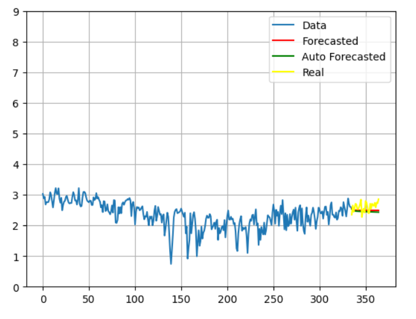

# Arima

In this project, I am developing a system to predict the minimum temperature each day using a technique known as the ARIMA algorithm.

ARIMA stands for AutoRegressive Integrated Moving Average. It is a forecasting model that helps predict future values based on historical data. ARIMA combines two main approaches: AutoRegressive (AR), which looks at the relationship between a value and its previous values, and Moving Average (MA), which analyzes the relationship between a value and the errors of previous forecasts.

To use ARIMA effectively, the data we work with must be stationary. This means that the data’s statistical properties, like its average and variance, should remain constant over time. We determine if the data is stationary using a test called the Augmented Dickey-Fuller (ADF) test.

The ARIMA model requires setting three specific parameters: p, d, and q. These parameters control different aspects of the model. The parameter 'd' represents the number of times we need to differ the data to make it stationary. The parameters 'p' and 'q' are found using diagrams called auto-correlation and partial auto-correlation plots, which help identify the relationships in the data.

You can determine these parameters manually, but there are tools available, like PMDARIMA, that automate this process and help find the best values for the model.

